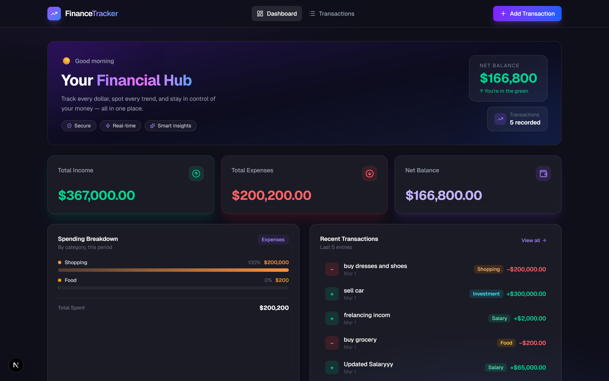
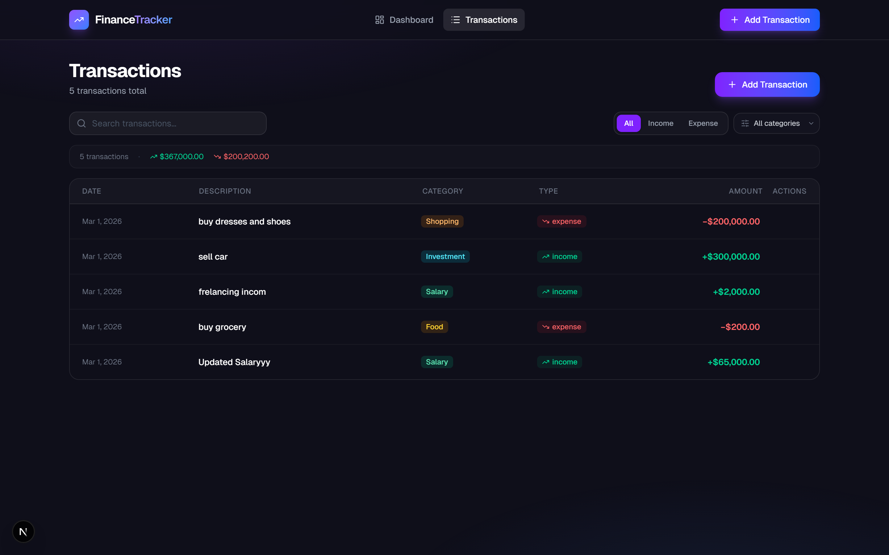
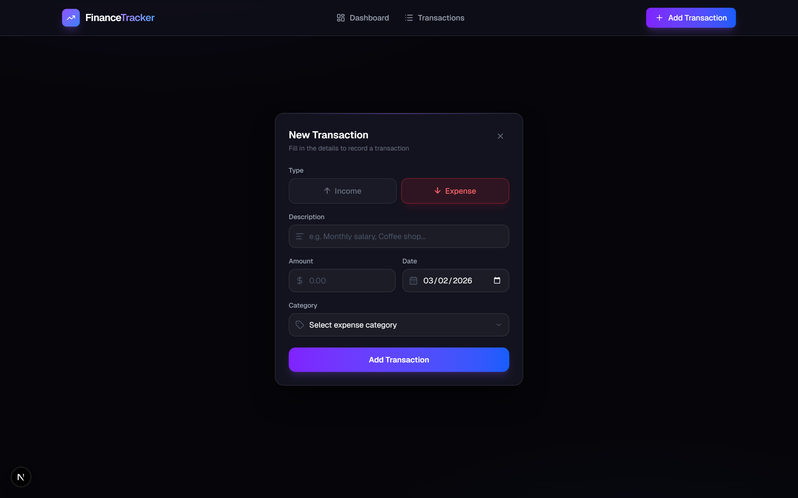

# Personal Finance Tracker

A full-stack web application for tracking personal income and expenses. Built with a FastAPI backend connected to a serverless PostgreSQL database and a Next.js frontend with a dark glassmorphism design, smooth animations, and a fully responsive layout.

---

## Live Demo

| | URL |
|---|---|
| **Frontend** | https://personal-finance-tracker-wmbqvfsf7-aasiasattars-projects.vercel.app |
| **Backend API** | https://personal-finance-tracker-production-7afb.up.railway.app |
| **API Docs** | https://personal-finance-tracker-production-7afb.up.railway.app/docs |

---

## Features

### Dashboard
- **Hero section** with a time-based greeting, net balance at a glance, transaction count, and motivational tagline
- **Summary cards** — Total Income, Total Expenses, Net Balance with colour-coded gradients (green / red / violet)
- **Spending breakdown chart** — animated horizontal bar chart showing expenses by category with gradient fills
- **Recent transactions strip** — last 5 transactions with quick navigation to the full list

### Transaction Management
- **Add transactions** via a focused modal form with type toggle (Income / Expense), dynamic category dropdown, description, amount, and date fields
- **Edit transactions** — pre-populated form at `/transactions/[id]/edit`; returns 404 for invalid IDs
- **Delete transactions** — animated confirmation modal with backdrop blur (no native `confirm()`)
- **Instant UI feedback** — deleted rows are removed from the local state immediately; form shows success/error banners

### Transactions List
- **Search** by description, category, or amount
- **Filter** by transaction type (All / Income / Expense) and category
- **Table layout** on desktop, **card layout** on mobile
- Transaction count and running totals in a summary strip

### API
- Full CRUD REST endpoints with Pydantic v2 validation
- `type` field accepts plural forms (`"expenses"` → `"expense"`) and is case-insensitive
- `category` is normalised to title case on write
- `GET /summary` computes income totals, expense totals, net balance, and per-category breakdown in a single call
- Filtering: `GET /transactions?type=income&category=Food`

### Design
- Dark theme (`#0F0F1A` base with radial violet / blue CSS glow effects)
- Glassmorphism cards (`bg-white/5 backdrop-blur border-white/10`)
- Framer Motion page entrance animations, staggered card reveals, animated form errors
- Skeleton loaders on every page (no spinners)
- Mobile-first responsive layout

---

## Tech Stack

| Layer | Technology | Version |
|---|---|---|
| Frontend framework | Next.js (App Router) | 16.1.6 |
| UI library | React | 19.2.3 |
| Styling | Tailwind CSS | v4 |
| Animations | Framer Motion | ^12 |
| Charts | Recharts | ^3 |
| Icons | Lucide React | ^0.575 |
| Backend framework | FastAPI | latest |
| Language (backend) | Python | 3.14 |
| ORM | SQLAlchemy | 2.x |
| Validation | Pydantic | v2 |
| Database | PostgreSQL via Neon | serverless |
| Python package manager | uv | latest |
| Backend tests | pytest + pytest-asyncio + httpx | — |
| Frontend tests | Vitest + React Testing Library | v4 / v16 |

---

## Project Structure

```
personal-finance-tracker/
│
├── backend/                        # FastAPI Python backend
│   ├── main.py                     # App entry point, all route handlers, CORS config
│   ├── database.py                 # SQLAlchemy engine, SessionLocal, get_db dependency
│   ├── models.py                   # Transaction ORM model
│   ├── schemas.py                  # Pydantic schemas: Create, Update, Response, Summary
│   ├── pyproject.toml              # Dependencies and pytest config
│   ├── .python-version             # Pinned Python version
│   ├── .env                        # ← not committed; contains DATABASE_URL
│   └── tests/
│       ├── conftest.py             # Async SQLite fixture, FastAPI dependency override
│       └── test_transactions.py    # 11 pytest tests covering full CRUD + summary
│
├── frontend/                       # Next.js frontend
│   ├── app/
│   │   ├── actions/
│   │   │   └── transactions.ts     # Server Actions (getTransactions, createTransaction, …)
│   │   ├── components/
│   │   │   ├── HeroSection.tsx     # Greeting banner with net balance + stats
│   │   │   ├── Navbar.tsx          # Persistent navigation bar
│   │   │   ├── SummaryCards.tsx    # Income / Expense / Balance cards
│   │   │   ├── SpendingChart.tsx   # Animated horizontal bar chart
│   │   │   ├── TransactionForm.tsx # Add / Edit modal form with client-side validation
│   │   │   └── TransactionsList.tsx# Full list with search, filters, delete modal
│   │   ├── transactions/
│   │   │   ├── page.tsx            # /transactions — full list page
│   │   │   ├── loading.tsx         # Skeleton loader for list page
│   │   │   ├── new/page.tsx        # /transactions/new — add form
│   │   │   └── [id]/edit/page.tsx  # /transactions/[id]/edit — edit form
│   │   ├── globals.css             # Dark theme, CSS glow variables
│   │   ├── layout.tsx              # Root layout with Navbar
│   │   ├── loading.tsx             # Skeleton loader for dashboard
│   │   └── page.tsx                # / — Dashboard
│   ├── __tests__/
│   │   └── transactions.test.tsx   # 14 Vitest tests (SummaryCards, TransactionForm, TransactionsList)
│   ├── vitest.config.ts            # Vitest config: jsdom, @ alias, setup file
│   ├── vitest.setup.ts             # Imports @testing-library/jest-dom matchers
│   ├── package.json
│   └── .env.local                  # ← not committed; contains NEXT_PUBLIC_API_URL
│
├── .gitignore
├── README.md
└── SPEC.md                         # Full project specification and phase checklist
```

---

## Environment Variables

### Backend — `backend/.env`

```env
DATABASE_URL=postgresql://<user>:<password>@<host>/<dbname>?sslmode=require
```

Obtain this from your [Neon](https://neon.tech) project dashboard → **Connection string**.

> The app auto-creates the `transactions` table on startup via `Base.metadata.create_all()`.

### Frontend — `frontend/.env.local`

```env
NEXT_PUBLIC_API_URL=http://localhost:8000
```

This tells Server Actions where to reach the FastAPI backend.

---

## Setup & Running

### Prerequisites

| Tool | Install |
|---|---|
| Python 3.12+ | [python.org](https://python.org) |
| uv | `pip install uv` or [docs.astral.sh/uv](https://docs.astral.sh/uv) |
| Node.js 18+ | [nodejs.org](https://nodejs.org) |
| npm | bundled with Node.js |

---

### 1 — Clone the repository

```bash
git clone https://github.com/aasiasattar/personal-finance-tracker.git
cd personal-finance-tracker
```

### 2 — Backend setup

```bash
cd backend

# Install Python dependencies
uv sync

# Create the .env file
echo DATABASE_URL=postgresql://<user>:<password>@<host>/<dbname>?sslmode=require > .env
```

Replace the placeholder with your actual Neon connection string.

### 3 — Start the backend server

```bash
# Still inside backend/
uv run uvicorn main:app --reload
```

The API will be live at **http://localhost:8000**.
Interactive docs: **http://localhost:8000/docs**

### 4 — Frontend setup

Open a second terminal:

```bash
cd frontend

# Install Node dependencies
npm install

# Create the .env.local file
echo NEXT_PUBLIC_API_URL=http://localhost:8000 > .env.local
```

### 5 — Start the frontend dev server

```bash
npm run dev
```

The app will be live at **http://localhost:3000**.

---

## API Reference

| Method | Endpoint | Description |
|--------|----------|-------------|
| `GET` | `/transactions` | List all transactions. Optional query params: `?type=income`, `?category=Food` |
| `POST` | `/transactions` | Create a transaction. Body: `TransactionCreate` |
| `GET` | `/transactions/{id}` | Fetch a single transaction. Returns 404 if not found |
| `PUT` | `/transactions/{id}` | Update fields on a transaction. Returns 404 if not found |
| `DELETE` | `/transactions/{id}` | Delete a transaction. Returns 204. Returns 404 if not found |
| `GET` | `/summary` | Totals: `total_income`, `total_expenses`, `net_balance`, `breakdown` (per-category) |

### Example request — create a transaction

```bash
curl -X POST http://localhost:8000/transactions \
  -H "Content-Type: application/json" \
  -d '{
    "description": "Monthly salary",
    "amount": 5000,
    "type": "income",
    "category": "Salary",
    "date": "2026-03-01"
  }'
```

### Valid categories

| Type | Categories |
|---|---|
| `income` | `Salary`, `Freelance`, `Investment`, `Other` |
| `expense` | `Food`, `Housing`, `Transport`, `Entertainment`, `Healthcare`, `Shopping`, `Other` |

---

## Running Tests

### Backend tests (pytest)

Tests use an **in-memory SQLite database** — no Neon connection required.

```bash
cd backend
uv run pytest -v
```

Expected output:

```
tests/test_transactions.py::test_create_transaction_success          PASSED
tests/test_transactions.py::test_get_all_transactions                PASSED
tests/test_transactions.py::test_get_all_transactions_type_filter    PASSED
tests/test_transactions.py::test_get_transaction_by_id               PASSED
tests/test_transactions.py::test_get_transaction_by_id_not_found     PASSED
tests/test_transactions.py::test_update_transaction                  PASSED
tests/test_transactions.py::test_delete_transaction                  PASSED
tests/test_transactions.py::test_get_summary_calculations            PASSED
tests/test_transactions.py::test_create_transaction_invalid_negative_amount  PASSED
tests/test_transactions.py::test_create_transaction_invalid_type     PASSED
tests/test_transactions.py::test_summary_empty_database              PASSED

11 passed in ~0.7s
```

### Frontend tests (Vitest)

```bash
cd frontend
npm test
```

Expected output:

```
✓ SummaryCards > renders all three card labels
✓ SummaryCards > displays correctly formatted currency amounts
✓ SummaryCards > renders negative net balance without crashing
✓ TransactionForm > renders all required input fields
✓ TransactionForm > shows validation errors when submitting with empty description
✓ TransactionForm > shows validation error for zero amount
✓ TransactionForm > switches category options when type changes
✓ TransactionForm > renders in edit mode with pre-populated values
✓ TransactionsList > renders all transaction descriptions
✓ TransactionsList > shows empty state when transactions array is empty
✓ TransactionsList > shows transaction count and totals in summary strip
✓ TransactionsList > filters transactions by search input
✓ TransactionsList > shows 'no results' empty state when search matches nothing
✓ TransactionsList > renders edit links with correct href for each transaction

14 passed in ~4s
```

---

## Screenshots

### Dashboard



### Transactions List



### Add Transaction Form



---

## Known Limitations

- **Local dev only** — no production deployment configured
- **No authentication** — all transactions are global (single-user app)
- The frontend calls the backend via Server Actions; the `NEXT_PUBLIC_API_URL` env var must be set before starting the dev server

---

## License

This project was built as a course submission. No licence applied.
